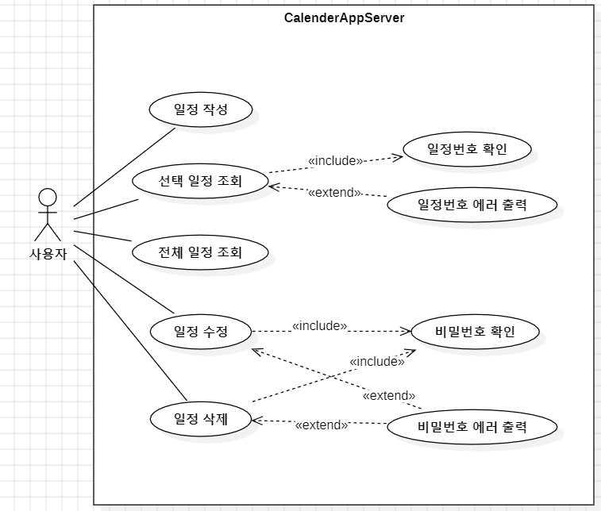
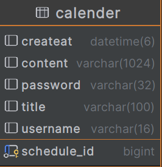

# 📅 개인 일정 관리 프로그램

---
+ 개인 일정을 관리하는 캘린더 API
---

# 🎛️ API 명세서
https://www.notion.so/ee9eb47c03f34c7bb21c40b21dae367c?v=7cc233e98e2b4dd88486649d01c7b74f

----

# 🛶 UsecaseDiagram

----

# 🔐 ERD

# 📚 기능 정의
- [x]  일정 작성 기능
    - `할일 제목`,`할일 내용`, `담당자`, `비밀번호`, `작성일`을 저장할 수 있습니다.
    - 저장된 게시글의 정보를 반환 받아 확인할 수 있습니다.
        - 반환 받은 게시글의 정보에 `비밀번호`는 제외 되어있습니다.
- [x]  선택한 일정 조회 기능
    - 선택한 일정의 정보를 조회할 수 있습니다.
        - 반환 받은 일정 정보에 `비밀번호`는 제외 되어있습니다.
- [x]  일정 목록 조회 기능
    - 등록된 일정 전체를 조회할 수 있습니다.
        - 반환 받은 일정 정보에 `비밀번호`는 제외 되어있습니다.
    - 조회된 일정 목록은 `작성일` 기준 내림차순으로 정렬 되어있습니다.
- [x]  선택한 일정 수정 기능
    - 선택한 일정의 `할일 제목`,`할일 내용`, `담당자`을 수정할 수 있습니다.
        - 서버에 일정 수정을 요청할 때 `비밀번호`를 함께 전달합니다.
        - 선택한 일정의 `비밀번호`와 요청할 때 함께 보낸 `비밀번호`가 일치할 경우에만 수정이 가능합니다.
    - 수정된 일정의 정보를 반환 받아 확인할 수 있습니다.
        - 반환 받은 일정의 정보에 `비밀번호`는 제외 되어있습니다.
- [x]  선택한 일정 삭제 기능
    - 선택한 일정을 삭제할 수 있습니다.
        - 서버에 일정 삭제를 요청할 때 `비밀번호`를 함께 전달합니다.
        - 선택한 일정의 `비밀번호`와 요청할 때 함께 보낸 `비밀번호`가 일치할 경우에만 삭제가 가능합니다.
          
- [x] 오류 발생 시 HTTP 코드 반환
  - 선택한 일정 수정 및 삭제 요청 시 비밀번호가 일치하지 않을 경우
    - API 요청 실패(예외상황)에 대해 판단할 수 있는 Status Code, Error 메시지등의 정보를 반환합니다.